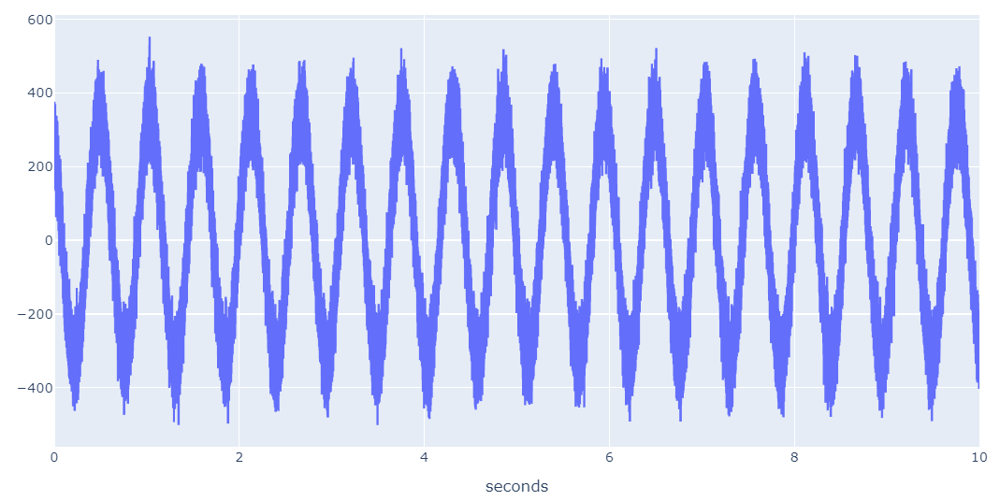

# Sine properties estimation

### Estimating sine properties from 1D array of raw data
Let say you have a noisy record of a sine, and you want to know its properties.<br>
Frequency estimation done by polynomial interpolation on fft values. <br> 
Estimating amp, phase and offset using least square on trigonometric sine identity. <br> 
Probably useful for DSP (signal processing) and spectral analysis. <br>

```
usage example:
    input:
        import numpy as np
        
        from sine_properties_estimation import calc_sine_properties

        # sine with random noise
        samples = 1000
        seconds = 10
        amp_mv = 340
        phase_rad = 2.2
        offset_mv = 60
        freq_ghz = 1.834
    
        t = np.linspace(0, seconds, samples)
        signal = amp_mv * np.sin(2 * np.pi * freq_ghz * t + phase_rad) + offset_mv + np.random.normal(0, 50, samples)
    
        estimation = calc_sine_properties(signal, seconds)
        print(f'estimated freq is {estimation.est_freq} Hz')
        print(f'estimated sine amp is {estimation.est_sine_amp}')
        estimation.print_estimation()
        
    output:
    
        estimate freq is 1.8372033171227042 Hz
        estimated sine amp is 338.5901422611014
        
               samples : 1000
         total_seocnds : 10
                  freq : 1.8372033171227042
              sine_amp : 338.5901422611014
             phase_rad : 2.0986036955592624
                offset : 63.01041660377115
        --------------------------------------------------
```
### Plot of that sine:
